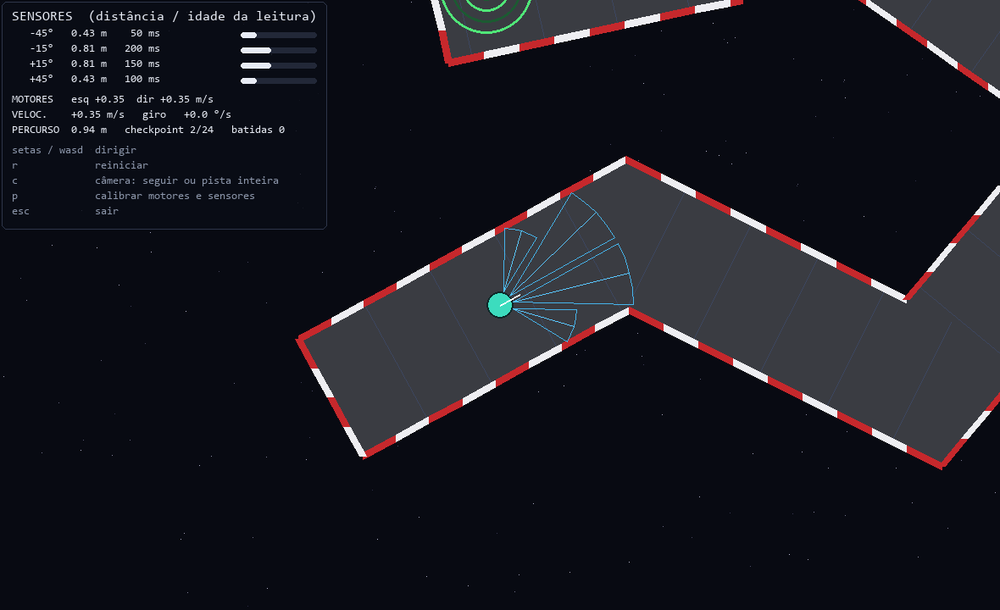
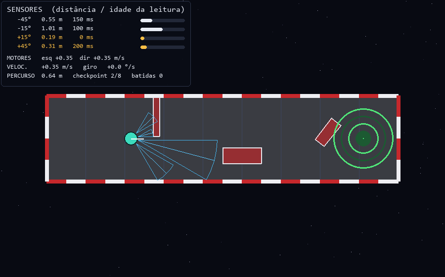
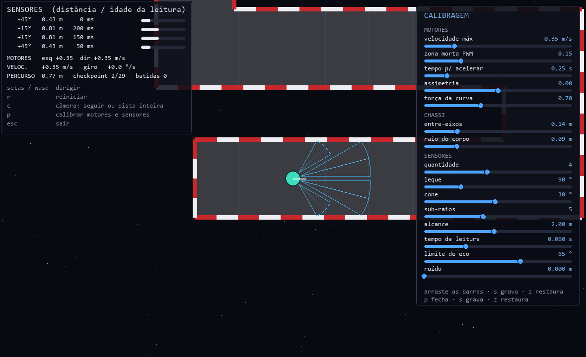
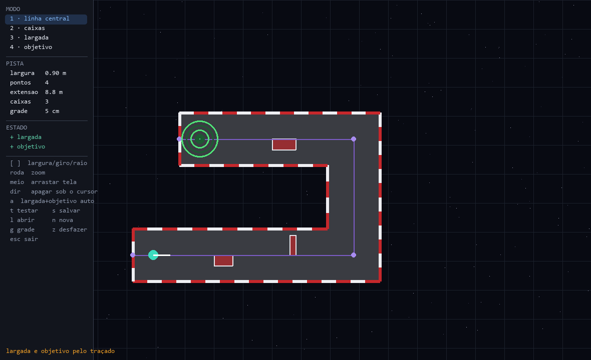
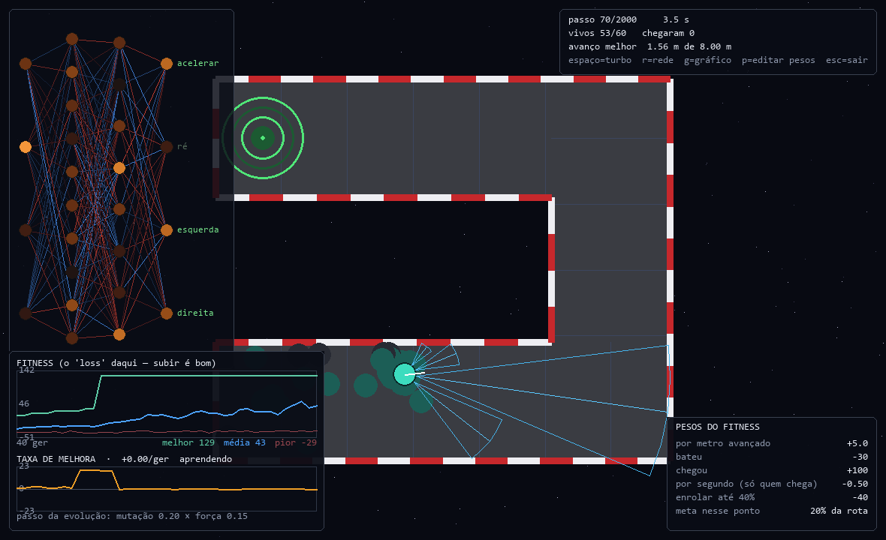
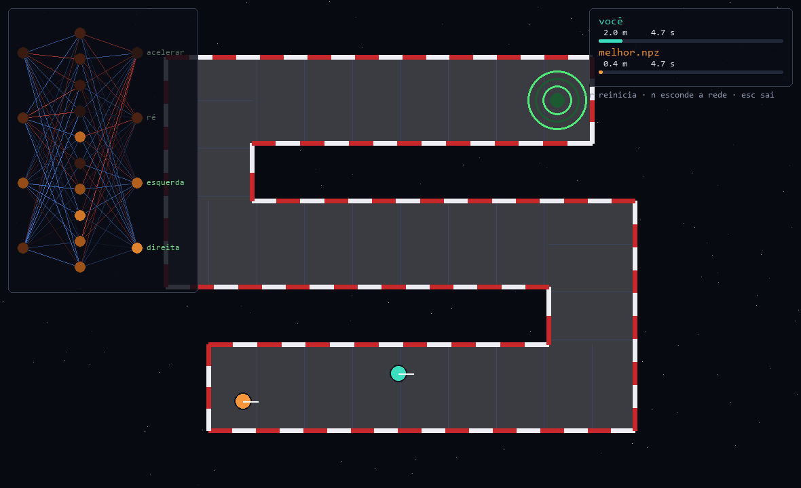

# Robô desviador de obstáculos

Simulador de um robô real — dois motores DC e sensores ultrassônicos HC-SR04 —
onde **você joga no teclado** e **sua rede neural joga o mesmo jogo**, pelos
mesmos quatro botões.

O objetivo não é um jogo. É treinar uma rede que funcione no robô **físico**:
cada detalhe da simulação existe para que a política aprendida aqui sobreviva ao
mundo real, onde o sensor mente, o motor tem folga e as leituras chegam
atrasadas.



---

## Índice

- [A ideia](#a-ideia) · [Comece aqui](#comece-aqui) · [As cinco partes](#as-cinco-partes)
- [Fidelidade ao hardware](#fidelidade-ao-hardware) · [Onde sua rede entra](#onde-sua-rede-entra)
- [Estrutura](#estrutura) · [Testes](#testes) · [Documentação](#documentação)

---

## A ideia

Um robô com quatro sensores de distância precisa atravessar um corredor sem
bater. Simples de enunciar, e cheio de armadilhas quando o alvo é hardware de
verdade:

- o HC-SR04 **não** mede um raio fino — devolve o obstáculo mais próximo num
  cone de ~30°;
- parede inclinada **não devolve eco nenhum**, e "sem eco" é indistinguível de
  "caminho livre";
- os sensores disparam **um de cada vez** (senão um escuta o eco do outro), então
  a rede sempre decide com dado velho;
- o motor tem **zona morta** e **inércia**, e os dois lados nunca puxam igual.

Um simulador que ignora isso produz uma rede que funciona lindamente na tela e
bate no primeiro obstáculo real. Aqui tudo isso está modelado e verificado por
testes.

**A divisão é deliberada:** o simulador entrega *fatos* (avançou tanto, bateu,
chegou), nunca uma nota. Quem decide o que vale ponto é você, na sua função de
fitness, fora do motor.

---

## Comece aqui

```bash
git clone https://github.com/MatheusBraga1106/robo-desviador.git
cd robo-desviador
py -m venv .venv
.venv\Scripts\python.exe -m pip install -r requirements.txt
```

Desenvolvido e testado no **Python 3.13**; não há sintaxe específica de versão,
então 3.10+ deve funcionar. As dependências são `numpy` e `pygame` — só isso.
PyTorch é opcional, e serve apenas para treinar na GPU ou converter uma rede
já treinada nele.

```bash
.venv\Scripts\python.exe -m robo.game
```

Setas ou WASD dirigem. `P` calibra, `C` alterna a câmera, `Esc` sai.

> No VS Code, `F5` já lista tudo pronto: jogar, editar pista, treinar, avaliar,
> correr contra a rede — 35 configurações em `.vscode/launch.json`.

---

## As cinco partes

### 1. Jogar

Você dirige com quatro botões: **acelerar, ré, esquerda, direita**. Eles viram
PWM dos dois motores — e é o **único** caminho de controle que existe no
projeto. A rede aperta exatamente as mesmas teclas, então o que você sente
jogando é literalmente o que ela enfrenta.

O HUD mostra cada sensor com a distância **e a idade da leitura**. Repare nos
`0 / 50 / 100 / 150 ms`: é o rodízio dos sensores acontecendo.



### 2. Calibrar

`P` abre 15 barras: velocidade, zona morta, inércia, assimetria dos motores,
quantidade e leque dos sensores, alcance, cone, latência. Você dirige enquanto
ajusta e sente o efeito na hora.

`S` grava em `config.json`, e **o treino lê o mesmo arquivo** — é assim que a
simulação se aproxima do seu robô.



### 3. Desenhar a pista

Você desenha a linha do meio do corredor; as paredes, o chão e os checkpoints
saem dela. `2` coloca caixas retangulares, `3` e `4` posicionam largada e
chegada, `T` testa dirigindo sem sair do editor.

Os avisos em laranja marcam curvas fechadas demais para a largura — o corredor
sairia com as paredes cruzadas, e sem o aviso você só descobriria dirigindo.



### 4. Treinar

Neuroevolução pronta para rodar em [`brains/treino_ga.py`](brains/treino_ga.py):
população inteira avaliada de uma vez, elitismo, seleção por torneio, crossover
e mutação — tudo vetorizado, sem laço por indivíduo.

```bash
.venv\Scripts\python.exe -m brains.treino_ga --ver-populacao
```



Quatro painéis ao vivo: a **rede** do campeão (vermelho excita, azul inibe), o
**fitness** por geração, a **taxa de melhora** (respondendo "ainda está
aprendendo?") e os **pesos** do fitness — editáveis com `P`, e o gráfico marca
onde você mexeu, para não comparar gerações medidas com réguas diferentes.

O treino grava checkpoints e retoma de onde parou. Verificado: treinar 10
gerações direto produz **histórico idêntico** a treinar 6 e retomar até 10.

### 5. Competir e avaliar

```bash
.venv\Scripts\python.exe -m robo.corrida --ultima
```



Vocês largam lado a lado, com a mesma física e os mesmos sensores. Sem `--rede`,
o adversário é uma regra fixa embutida: se sua rede não ganhar dela, ela ainda
não aprendeu nada.

E para saber se ela **generalizou ou decorou**:

```bash
.venv\Scripts\python.exe -m brains.avaliar --treinada-em curva-u
```

A rede aqui vê só as distâncias dos sensores e não tem memória — não consegue
decorar "no passo 300 vire à esquerda". Mas consegue aprender um **reflexo
enviesado**: "na dúvida vire à esquerda" resolve uma pista de curvas à esquerda
e desmonta em qualquer outra. Por isso o avaliador testa:

| teste | o que revela |
|---|---|
| pista **espelhada** | mesmas curvas, invertidas — expõe viés de lado |
| **largada sorteada** | se depende da pose exata em vez dos sensores |
| todas as **outras pistas** | se o desempenho desaba fora do treino |

E escreve o veredito:

```
FRÁGIL À LARGADA: chega 100% saindo da pose exata, mas só 8% com a largada
variando alguns centímetros. A política depende do ponto de partida, não do
que os sensores mostram — no robô real isso não se sustenta.
```

---

## Fidelidade ao hardware

O que separa este simulador de um brinquedo:

| detalhe | por que importa |
|---|---|
| **cone de 30°**, não raio | o HC-SR04 pega o obstáculo mais próximo do cone inteiro |
| **eco perdido** acima de 65° | parede inclinada lê como "livre" — é assim que robô com ultrassom bate de frente |
| **rodízio** de sensores | disparar junto causa crosstalk; com 4 sensores a varredura leva 240 ms |
| **zona morta** do PWM | abaixo do limiar o motor não vence o atrito |
| **inércia** do motor | a roda leva tempo para chegar na velocidade pedida |
| **assimetria** entre motores | com 6% de diferença o robô desvia 22 cm em 3 s andando "reto" |

Uma consequência medida, que muda o projeto do robô: **com número par de
sensores nenhum aponta para frente**. A 1 m de uma parede frontal, num corredor
de 0,9 m:

| arranjo | menor leitura |
|---|---|
| 4 sensores em 150° | 0,61 m — é a **parede lateral**; a frontal só aparece a ~0,6 m |
| 4 em 90° (padrão) | 0,81 m |
| 5 em 150° (com sensor central) | 1,00 m — enxerga a parede inteira |

---

## Onde sua rede entra

O contrato inteiro cabe num método:

```python
class MinhaRede:
    def act_batch(self, obs):      # (P, n_sensores) em [0,1] -> (P, 4) em [0,1]
        ...
```

Saída: `[acelerar, ré, esquerda, direita]`, acima de 0,5 conta como apertado.
Nenhum framework assumido — numpy, PyTorch, o que você quiser.

```python
runner = EpisodeRunner(track, cfg, n_robots=100)
dados = runner.run(minha_rede, seed=geracao)
fitness = minha_formula(dados)        # o simulador não opina
```

A telemetria traz `progress` (avanço **ao longo do traçado**, não em linha
reta), `collided`, `finished`, `time`, `checkpoints` e mais. Para treino com
gradiente há também um laço passo a passo com fatos por transição, para você
montar a recompensa do PPO/DQN.

Redes treinadas são salvas num **formato neutro** (`.npz`: matrizes, vieses,
ativações e a config do treino) — porque o destino final é um Arduino, onde não
existe PyTorch. Verificado: o numpy reproduz a saída do torch com erro de 4e-8.

---

## Estrutura

```
robo/          o simulador
  config.py      parâmetros do robô e dos sensores
  sensors.py     modelo do HC-SR04 (cone, eco perdido, rodízio)
  physics.py     4 botões -> PWM -> movimento
  world.py       P robôs num percurso; devolve telemetria crua
  track.py       a receita da pista; as paredes saem dela
  brain.py       o contrato da sua rede
  training.py    EpisodeRunner: episódio inteiro ou passo a passo
  game.py        modo de jogar          editor.py    editor de pista
  corrida.py     você contra a rede     persist.py   salvar/carregar redes
  render.py netviz.py grafico.py viewer.py calibra.py   (interface)

brains/        onde a inteligência mora — é seu território
  exemplo.py     rede aleatória de referência + os pesos do fitness
  treino_ga.py   neuroevolução completa, com checkpoint e retomada
  avaliar.py     testa generalização em pistas novas

tracks/        pistas salvas no editor
tests/         10 arquivos de verificação
arduino/       firmware de referência (da versão anterior — ver GUIA.md)
```

---

## Testes

```bash
.venv\Scripts\python.exe -m tests.test_nucleo
```

Dez arquivos, um por área. Alguns exemplos do que travam:

- o **raycast** vetorizado bate com a força bruta dentro de 1,5e-4;
- a mesma parede lê **0,91 m de frente e "livre" a 75°** — o eco perdido;
- **retomar um checkpoint** produz histórico bit a bit idêntico a nunca ter
  parado;
- o robô que **anda mais** pontua mais que o que fica girando;
- 100 robôs rodam a **~2400 passos/s**, folgado para assistir ao treino.

No VS Code: `Ctrl+Shift+B` roda todos.

---

## Documentação

- **[GUIA.md](GUIA.md)** — o manual completo: instalação, VS Code, cada modo
  passo a passo, como treinar, como salvar, perguntas frequentes.
- Os módulos são comentados explicando **por quê**, não o quê — em especial as
  decisões que parecem arbitrárias mas vieram de uma medição.

---

## Estado

As cinco etapas planejadas estão prontas: jogo, editor, contrato da rede,
visualização e corrida. O que falta é o gerador de firmware — converter o
`.npz` treinado em arrays C para o Arduino. A lógica é a mesma de
`RedeSalva.act_batch`, só que em C.
